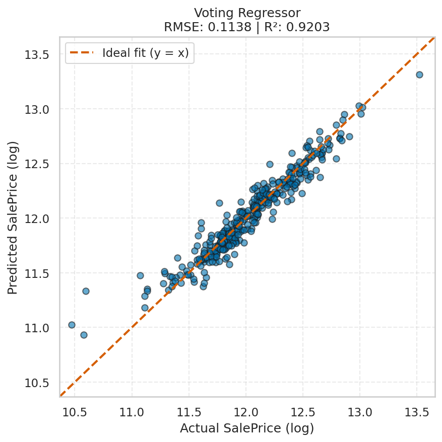

# House Prices Prediction (Ames Dataset)

Predicting house sale prices using advanced feature engineering, pipelines, and ensemble models
(Random Forest, Gradient Boosting, Ridge Regression, Lasso, SVM and a Voting Regressor).

---

## 📌 Project Structure

```

├── data/
│   ├── raw/               # Original raw data
│   ├── interim/           # Intermediate cleaned data
│   └── processed/         # Train/test splits and prepared features
├── notebooks/
│   ├── 01_eda_and_feature_engineering.ipynb
│   ├── 02_voting_ensemble.ipynb
│   └── 03_gradient_boosting_optimized.ipynb
├── src/
│   └── build_features.py  # Centralized feature engineering
├── reports/
│   ├── figures/           # Plots and visualizations
│   └── tables/            # Cross-validation results, best model tables
├── config/                # Models configuration
├── tests/                 # Pytest unit tests
└── requirements.txt

````

---

## 📊 Result Visualization

### Model Results (Voting Regressor)


---

## 🚀 Modeling Workflow

### 1. Feature Engineering
The function `build_features()` creates domain-inspired variables:

- `TotalSF`
- `TotalBathrooms`
- `Age`
- `MoSold_cat`
- `PorchSF`
- `HasGarage`, `Has2ndFloor`, `HasPool`, `HasBsmt`
- `Remodeled`
- `ComponentsQual`

### 2. Pipelines
All transformations are implemented inside a single `Pipeline` using:

- `ColumnTransformer`
- `OneHotEncoder`
- `SimpleImputer`
- `StandardScaler`
- `FunctionTransformer`

### 3. Model Training

Models explored:

- RandomForestRegressor
- GradientBoostingRegressor
- Ridge
- Lasso
- SVM

Hyperparameter optimization via:

```python
GridSearchCV(
    cv=5,
    scoring="neg_root_mean_squared_error",
    n_jobs=-1,
)
````

### 4. Ensembling

A `VotingRegressor` is built using the best tuned models.

---

## 📈 Final Results

| Model             | CV RMSE |
| ----------------- | ------- |
| Gradient Boosting | $20,340.99 |
| Voting Regressor  | $23,130.06 |

---

## 🧪 Tests

This project includes a minimal but solid test suite using **pytest** to ensure data consistency and pipeline stability.

### Included tests

- **test_build_features_columns_exist**  
Ensures that the engineered features (e.g., `TotalSF`, `TotalBathrooms`, `Age`, etc.) are correctly created and present in the transformed dataset.

- **test_build_features_preserves_row_count**  
Validates that the number of rows remains unchanged after applying feature engineering (prevents accidental row drops).

- **test_pipeline_runs**  
Checks that the full preprocessing pipeline (imputation, scaling, one-hot encoding) fits without errors on the raw dataset.

- **test_pipeline_transform_shape**  
Ensures that the pipeline’s `transform()` keeps the same number of rows as the input.

From the project root:

```bash
pytest -q
```

---

## 🛠 Requirements

```
python== 3.12
joblib== 1.5.2
numpy== 2.3.4
pandas== 2.3.3
matplotlib== 3.10.7
seaborn== 0.13.2
scikit-learn== 1.7.2
```

---

## ⭐ Author

Luis Renteria Lezano — AI/ML Student
